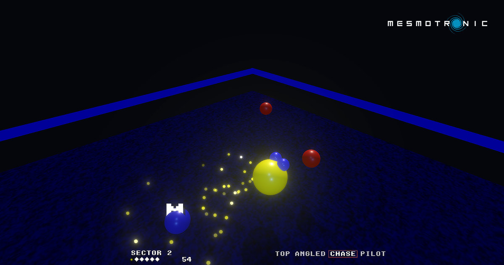

# Koules 3D

Ported to [Three.js](https://threejs.org/) by [Mesmotronic](https://mesmotronic.com).

## Introduction

Bounce the koules out of your sector before they bounce you out of yours.

Based on [Jan Hubicka's 1995 action game for Linux](https://www.ucw.cz/~hubicka/koules/English/),
via [Lubomir Rintel's SDL port](https://github.com/lkundrak/koules), the
Three.js version faithfully reporoduces the simulation while adding a whole new
third dimension never seen in Koules before: traditional 2D, perspective, first
and third person view, plus split-screen multiplayer action and touch controls!

Requires WebGPU (Chrome, Edge or Safari).

## Controls

| What?       | Key                                              |
| ----------- | ------------------------------------------------ |
| Player 1    | arrow keys                                       |
| Player 2    | `W` `A` `S` `D`                                  |
| Players 3–5 | `IJKL`, numpad, `TFGH` — all rebindable          |
| Help labels | `H`                                              |
| Menu        | `Esc`                                            |
| Touch       | Anywhere — that point becomes the stick's centre |
| View        | `1`–`4`, or `V` to cycle                         |
| Pause       | `P`                                              |

Per player, `CONTROL` cycles eight-way keyboard, rotation keyboard, mouse and
gamepad. Progress, bindings and options persist in localStorage.

## Licence

GPL-2.0-or-later; the full text is in [COPYING](COPYING).

Koules is © 1995–1996 Jan Hubicka. This port is © 2026 Mesmotronic Limited and
carries the same licence, as a derivative work must. Every source file has an
SPDX header naming its copyright holders: files ported from the C name their
upstream authors alongside Mesmotronic, because the GPL requires those notices
to stay intact, and because the work deserves the credit. Beyond Hubicka that
means Lubomir Rintel for the SDL backend, Ludvik Tesar for the joystick
handling, Sujal M. Patel for the sound code, and Kamil Toman and Thomas Marsh
for the scripts.
